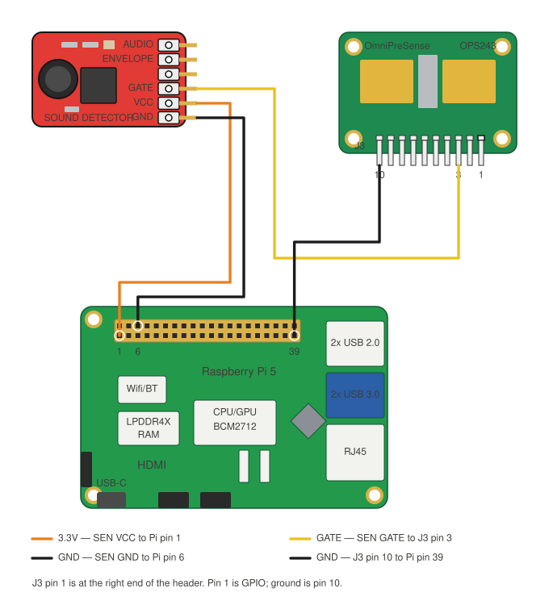

# Sound Trigger Wiring Guide

Step-by-step instructions for wiring the sound trigger that enables spin detection in rolling buffer mode.

> **Parts needed:** See the [Parts List](PARTS.md#sound-trigger-for-rolling-buffer-mode) for what to buy.

> **Running the OPS243 on the Pi GPIO UART instead of USB?** This trigger
> wiring is unchanged — `GATE` still drives `HOST_INT` directly. See
> [Moving the OPS243 from USB to the Pi GPIO UART](ops243-uart-migration.md)
> for the data and power side.

## Overview

The SparkFun SEN-14262 sound detector listens for club impact and triggers the OPS243-A radar to dump its I/Q buffer. That captured data is then analyzed for spin rate estimation.

The wiring is simple — three wires off the detector, plus the radar's ground
return:

```
SEN-14262 GATE → OPS243-A HOST_INT (J3 Pin 3)
SEN-14262 VCC  → Raspberry Pi 3.3V
SEN-14262 GND  → Raspberry Pi GND
OPS243-A GND   → Raspberry Pi GND (J3 Pin 10, shared rail)
```



*The OPS243 keeps its micro-USB connection for data and power here; only the
trigger and ground are wired by hand. To take the radar off USB as well, see
[the UART migration](ops243-uart-migration.md).*

## Before You Wire: Solder R17

The SEN-14262 is designed for 5V but runs at 3.3V in this setup. At 3.3V the preamp gain is too high and the GATE output can get stuck high. To fix this, solder a through-hole resistor into the **R17** position on the SEN-14262 board.

R17 sits in parallel with the onboard 100kΩ surface-mount R3, reducing the preamp gain:

| R17 Value | Effective Resistance | Gain Reduction |
|-----------|---------------------|----------------|
| 47kΩ | ~32kΩ | Moderate — try this first |
| 33kΩ | ~25kΩ | More aggressive — for noisy environments |

Start with 47kΩ. If the GATE LED still stays lit without sound, switch to a lower value.

> **Want to change sensitivity without a soldering iron?** Fit an X9C104 digital
> potentiometer to the R17 pads instead of a fixed resistor and tune it from the
> UI. See [Optional: Software-Controlled Sensitivity](#optional-software-controlled-sensitivity-x9c104-digital-pot)
> below. Wire the rest of the trigger first and get it working with a soldered
> resistor — the digipot replaces one component, not the whole guide.

---

## Wiring

### Step 1: Identify OPS243-A J3 Header Pins

`J3` is the **10-pin** header on the OPS243-A. Pin 1 is at the **right** end, so
the numbering runs right to left:

```
OPS243-A J3 header:
┌────┬────┬────┬────┬────┬────┬────┬────┬────┬────┐
│ 10 │  9 │  8 │  7 │  6 │  5 │  4 │  3 │  2 │  1 │
│GND │ 5V │    │TxD │RxD │    │    │INT │    │IO  │
└────┴────┴────┴────┴────┴────┴────┴────┴────┴────┘
```

The two pins this guide needs:

- **Pin 3** = HOST_INT (trigger input)
- **Pin 10** = GND

### Step 2: Connect Power

1. Connect **SEN-14262 VCC** → **Pi 3.3V** (physical pin 1)
2. Connect **SEN-14262 GND** → **Pi GND** (physical pin 6)
3. Connect **OPS243-A GND (J3 Pin 10)** → same **Pi GND** rail

All three boards must share a common ground.

### Step 3: Connect Trigger

1. Connect **SEN-14262 GATE** → **OPS243-A HOST_INT (J3 Pin 3)**

That's it. No level shifter, no MOSFETs, no breadboard needed.

```
SEN-14262               Raspberry Pi           OPS243-A
┌───────────┐          ┌──────────┐          ┌──────────┐
│ VCC ──────┼──────────┤ 3.3V     │          │          │
│           │          │          │          │          │
│ GATE ─────┼──────────┼──────────┼──────────┤ HOST_INT │
│           │          │          │          │ (J3 P3)  │
│ GND ──────┼──────────┤ GND      ├──────────┤ GND      │
│           │          │          │          │ (J3 P10) │
└───────────┘          └──────────┘          └──────────┘
```

---

## Wiring Checklist

- [ ] R17 resistor soldered on SEN-14262 board
- [ ] SEN-14262 VCC → Pi 3.3V (pin 1)
- [ ] SEN-14262 GND → Pi GND (pin 6)
- [ ] SEN-14262 GATE → OPS243-A HOST_INT (J3 Pin 3)
- [ ] OPS243-A GND (J3 Pin 10) → Pi GND (shared ground)

---

## One-Time Radar Setup

The OPS243-A must have rolling buffer mode saved to persistent memory for HOST_INT triggers to work. This is due to a firmware bug where the HOST_INT pin mode changes when transitioning modes at runtime.

```bash
# Configure and save rolling buffer mode to flash (one-time)
uv run python scripts/hardware-test/test_rolling_buffer_persist.py --setup

# Power cycle the radar (unplug USB, wait 3s, replug)

# Verify
uv run python scripts/hardware-test/test_rolling_buffer_persist.py --test
```

---

## Testing

### Quick Test: Visual

Make a loud sound near the SEN-14262. The onboard LED should flash briefly, then turn off. If the LED stays on constantly, you need a lower-value resistor in R17.

### Full Test: Software

```bash
uv run python scripts/hardware-test/test_sound_trigger_hardware.py
```

You should see:
```
Ready for hardware sound triggers!
Make a sound near the sensor... (Ctrl+C to quit)

[1] Waiting for hardware trigger (timeout=60s)...
  TRIGGER RECEIVED after 0.02s!
  I/Q samples: 4096 I, 4096 Q
```

---

## Optional: Software-Controlled Sensitivity (X9C104 Digital Pot)

A soldered R17 fixes the detector's gain at one value. Swapping it for an
**X9C104** 100 kΩ digital potentiometer puts that resistance under software
control, so sensitivity becomes a slider on the **Debug → Tuning** page instead
of a trip to the bench. Everything else about the trigger is unchanged: `GATE`
still drives `HOST_INT` directly, and the ~10 µs hardware latency is untouched.

This is optional. Skip it if a fixed resistor works for where you hit.

### Why It Works

`R17` sits in parallel with the SEN-14262's onboard 100 kΩ `R3`, and together
they set the preamp's gain. A **lower** parallel resistance means **less gain**,
so a lower R17 makes the detector **less** sensitive:

| Wiper position | R17 (pot) | Preamp leg (R17 ∥ R3) | Behaviour |
|----------------|-----------|-----------------------|-----------|
| 0 | ~40 Ω | ~40 Ω | Least sensitive — near-total shunt |
| 33 | ~33 kΩ | ~25 kΩ | The guide's "noisy environment" value |
| 46 (default) | ~46.5 kΩ | ~32 kΩ | The guide's recommended 47 kΩ starting point |
| 99 | ~100 kΩ | ~50 kΩ | Most sensitive within the pot's range |

The X9C104 has 100 tap points across a 100 kΩ element, so one tap is about 1 kΩ.
OpenFlight starts it at position **46**, which lands within a step of the 47 kΩ
resistor this guide has always recommended — so fitting the pot does not change
how an existing build behaves on the first boot.

### Parts

- One **X9C104P** (8-pin DIP, 100 kΩ). Not an X9C102/103/503 — those top out at
  1 kΩ / 10 kΩ / 50 kΩ and cannot reach 47 kΩ.
- Five jumper wires to the Pi header, plus two short leads to the R17 pads.

### X9C104 Pinout

```
        X9C104 (8-pin DIP, notch at top)
            ┌───────∪───────┐
    INC  1 ─┤               ├─ 8  VCC
    U/D  2 ─┤               ├─ 7  CS
  RH/VH  3 ─┤               ├─ 6  RL/VL
    VSS  4 ─┤               ├─ 5  RW/VW
            └───────────────┘
```

- `CS` (7) — chip select, active low
- `INC` (1) — increment; the wiper moves on each falling edge
- `U/D` (2) — direction: high steps toward `RH`, low toward `RL`
- `RH` / `RW` / `RL` (3/5/6) — the resistor element and its wiper

### Step 1: Connect the Pot to the Pi

| X9C104 | Signal | Pi header | BCM |
|--------|--------|-----------|-----|
| Pin 8 | VCC | Physical **2** (5V) | — |
| Pin 4 | VSS | Physical **14** (GND) | — |
| Pin 7 | CS | Physical **15** | **BCM22** |
| Pin 1 | INC | Physical **16** | **BCM23** |
| Pin 2 | U/D | Physical **18** | **BCM24** |

**Power it from 5V, not 3.3V.** The X9C104's DC characteristics are specified at
5V. Its logic inputs read high from 2.0V, so the Pi's 3.3V GPIOs drive `CS`,
`INC` and `U/D` directly with no level shifter. The resistor element only ever
sees the detector's 3.3V rail, which is well inside the pot's 0–5V analog range.

The three GPIOs are configurable — pass `--sound-sensitivity-cs-pin`,
`--sound-sensitivity-inc-pin` and `--sound-sensitivity-ud-pin` if these clash
with something else on your build. They must not be BCM17: that GPIO carries the
shared sound-trigger edge, and the server refuses to start if you try.

### Step 2: Connect the Pot to the R17 Pads

Tie **pin 3 (RH) to pin 5 (RW)** with a short link, then wire that pair to one
R17 pad and **pin 6 (RL)** to the other:

```
   X9C104                          SEN-14262
┌───────────┐                    ┌─────────────┐
│  RH (3) ──┼──┐                 │             │
│           │  ├──────────────── ┤ R17 pad     │
│  RW (5) ──┼──┘                 │             │
│           │                    │  (parallel  │
│  RL (6) ──┼─────────────────── ┤   with R3)  │
│           │                    │             │
│ VSS (4) ──┼──── Pi GND ────────┤ GND         │
└───────────┘                    └─────────────┘
```

- **R17 is not polarised** — it is a plain two-pad footprint, so either pad can
  take either lead. What matters is that the pot's `RL` end goes to one pad and
  the wiper (`RW`) to the other. Wiring `RH` to a pad *instead of* `RL` inverts
  the slider: turning it up would make the detector less sensitive.
- **Tying `RH` to `RW` is deliberate.** It shorts out the unused half of the
  element so nothing floats, and leaves the pad-to-pad resistance equal to the
  wiper-to-`RL` value the software reports.
- Keep the two leads short. This is a high-impedance node on an audio preamp;
  long unshielded wire picks up hum that reads as a false trigger.
- All boards must still share a ground: `VSS` goes to the same Pi GND rail as
  the SEN-14262 and the OPS243-A.

### Step 3: Enable It

```bash
scripts/start-kiosk.sh --sound-sensitivity
```

On startup the server prints the tap it applied:

```
Sound sensitivity control enabled (X9C104 position 46, ~46504 ohm R17)
```

If the pot cannot be brought up, the server logs a warning and carries on — the
detector keeps whatever gain the hardware is at, and the Debug page shows the
control as unavailable with the reason. Sensitivity is a convenience, never a
prerequisite for detecting a shot.

Useful flags:

| Flag | Purpose |
|------|---------|
| `--sound-sensitivity` | Enable the control (off by default) |
| `--sound-sensitivity-position N` | Force tap `N` (0–99) at startup, overriding the saved value |
| `--sound-sensitivity-cs-pin N` | Move `CS` off BCM22 |
| `--sound-sensitivity-inc-pin N` | Move `INC` off BCM23 |
| `--sound-sensitivity-ud-pin N` | Move `U/D` off BCM24 |

### Step 4: Verify with a Meter

Stop the server first — it holds the same GPIO lines — then sweep the wiper with
a multimeter across the R17 pads:

```bash
uv run python scripts/hardware-test/test_x9c104.py --sweep
```

You should see the pad-to-pad resistance climb from a few tens of ohms to about
100 kΩ in step with the printed positions. To park it at one value:

```bash
uv run python scripts/hardware-test/test_x9c104.py --position 46
```

### Step 5: Tune from the UI

Open **Debug → Tuning** and use the **Sound Trigger Sensitivity** slider. The
readout under it shows the applied percentage, the resistance R17 now presents,
and the resulting preamp leg.

- **Triggering on ambient noise** (a door, a fan, a neighbouring bay) — turn it
  **down**.
- **Missing strikes**, or the GATE LED not flashing on a clean hit — turn it
  **up**.
- **GATE LED stuck on** at every setting — the gain is not the problem; go back
  to the wiring checks below.

**Recalibrate wiper** re-homes the wiper against the `RL` end and steps back to
the current position. The X9C104 cannot be read back, so the position OpenFlight
shows is a model of the chip rather than a measurement; if a brown-out or a
glitched line makes the two disagree, this resyncs them.

### What OpenFlight Stores, and Where

The setting is saved to `~/.config/openflight/sound_sensitivity.json` and
re-applied at every startup.

OpenFlight deliberately **never writes the X9C104's own non-volatile memory**.
That NVM is rated for about 100,000 stores, and saving on every slider move
would wear the part out for no benefit — the server re-homes and re-applies the
saved position on each boot anyway.

The practical consequence: if you power the detector **without** running
OpenFlight, its gain is whatever the chip last committed to NVM, which for a new
part is an arbitrary factory value. Anything that runs through the server —
including `scripts/start-kiosk.sh` — sets it correctly.

### Digipot Wiring Checklist

- [ ] X9C104 pin 8 (VCC) → Pi 5V (physical pin 2)
- [ ] X9C104 pin 4 (VSS) → Pi GND (physical pin 14, same rail as the detector)
- [ ] X9C104 pin 7 (CS) → Pi BCM22 (physical pin 15)
- [ ] X9C104 pin 1 (INC) → Pi BCM23 (physical pin 16)
- [ ] X9C104 pin 2 (U/D) → Pi BCM24 (physical pin 18)
- [ ] X9C104 pin 3 (RH) linked to pin 5 (RW)
- [ ] RH+RW pair → one R17 pad; pin 6 (RL) → the other R17 pad
- [ ] No fixed resistor left soldered in R17 (it would parallel the pot)
- [ ] `--sound-sensitivity` passed to the server

---

## Troubleshooting

### GATE LED stays on (stuck high)

The preamp gain is too high for 3.3V operation.
- **Fix:** Solder a lower-value resistor into R17 (try 33kΩ instead of 47kΩ)

### No trigger received

1. Check the GATE LED flashes when you clap
2. Verify GND is shared between all three boards (Pi, SEN-14262, OPS243-A)
3. Verify HOST_INT is J3 **Pin 3** (not Pin 2)
4. Run `uv run python scripts/hardware-test/test_rolling_buffer_persist.py --test` to confirm radar is in rolling buffer mode

### Triggers constantly / too sensitive

- Use a lower-value R17 resistor to reduce gain
- Move the sensor further from the hitting area

### Triggers but no I/Q data

- Run the one-time radar setup (see above) — HOST_INT mode must be saved to flash
- Power cycle the radar after setup

### Digital pot: "Sound sensitivity control unavailable" at startup

The server could not claim the GPIO lines.

1. Check nothing else already holds them — a second server, or a hardware-test
   script left running.
2. Confirm the user is in the `gpio` group: `groups | grep gpio`.
3. If this Pi exposes the header on a different gpiochip, set
   `OPENFLIGHT_GPIO_CHIP`.

### Digital pot: slider moves but the detector does not change

The control lines are working (the server would have errored otherwise), so the
problem is on the resistor side.

1. Stop the server and sweep with a meter across the R17 pads:
   `uv run python scripts/hardware-test/test_x9c104.py --sweep`. A reading stuck
   at one value means a cold joint on `RW`, `RL`, or an R17 pad.
2. Check no fixed resistor is still soldered into R17 — it parallels the pot and
   flattens its range.

### Digital pot: turning sensitivity up makes it less sensitive

`RH` (pin 3) is wired to an R17 pad in place of `RL` (pin 6). Move the pad lead
to pin 6 and keep pin 3 linked to pin 5.

### Digital pot: the position drifts from what the UI shows

The X9C104 has no readback, so the displayed position is a model of the chip. A
brown-out or a glitched control line can desynchronise them. Press
**Recalibrate wiper** on the Debug page, or restart the server — both re-home
the wiper against the `RL` end.
